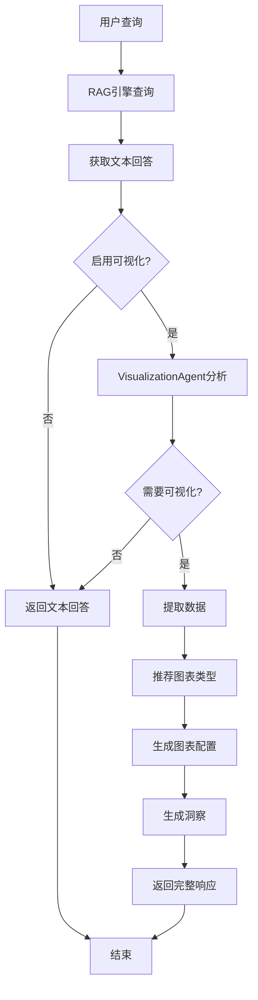

# 📊 智能可视化功能使用指南

## 🎯 功能概述

LlamaReportPro 现已集成**智能可视化生成Agent**，能够在问答和报告分析过程中自动生成合适的图表，增强数据洞察能力。

### 核心特性

✅ **自动检测** - 智能分析查询和回答，判断是否需要可视化  
✅ **智能推荐** - 基于数据类型自动推荐最合适的图表类型  
✅ **多种图表** - 支持柱状图、折线图、饼图、面积图等多种图表  
✅ **数据洞察** - 自动生成趋势分析、极值分析等洞察  
✅ **无缝集成** - 与现有问答和Agent系统完美集成  

---

## 🏗️ 架构设计

### 1. 核心组件

```
llamareport-backend/
├── models/
│   └── visualization_models.py      # 可视化数据模型
├── agents/
│   ├── visualization_agent.py       # 可视化生成Agent
│   ├── report_agent.py              # 报告Agent（已集成）
│   └── report_tools.py              # 报告工具（已集成）
└── api/
    └── query.py                     # 查询API（已集成）
```

### 2. 数据模型

#### ChartType (图表类型)
```python
class ChartType(str, Enum):
    BAR = "bar"              # 柱状图
    LINE = "line"            # 折线图
    PIE = "pie"              # 饼图
    SCATTER = "scatter"      # 散点图
    AREA = "area"            # 面积图
    MULTI_LINE = "multi_line"  # 多折线图
    GROUPED_BAR = "grouped_bar"  # 分组柱状图
    # ... 更多类型
```

#### VisualizationResponse (可视化响应)
```python
class VisualizationResponse(BaseModel):
    query: str                          # 原始查询
    answer: str                         # 文本回答
    has_visualization: bool             # 是否包含可视化
    chart_config: PlotlyChartConfig     # Plotly图表配置
    recommendation: ChartRecommendation # 图表推荐
    insights: List[VisualizationInsight]  # 数据洞察
    confidence_score: float             # 置信度分数
```

---

## 🚀 使用方法

### 方法1: API调用

#### 1.1 查询接口（自动可视化）

```python
import requests

# 发送查询请求
response = requests.post(
    "http://localhost:8000/query/ask",
    json={
        "question": "公司2021-2023年的营业收入趋势如何？",
        "enable_visualization": True  # 启用可视化
    }
)

data = response.json()

# 获取文本回答
print(data['answer'])

# 获取可视化配置
if data['visualization']['has_visualization']:
    chart_config = data['visualization']['chart_config']
    insights = data['visualization']['insights']
    
    # 使用Plotly渲染图表
    import plotly.graph_objects as go
    
    traces = [
        go.Scatter(
            x=trace['x'],
            y=trace['y'],
            mode=trace.get('mode', 'lines'),
            name=trace['name']
        )
        for trace in chart_config['traces']
    ]
    
    fig = go.Figure(data=traces)
    fig.update_layout(title=chart_config['layout']['title'])
    fig.show()
```

#### 1.2 禁用可视化

```python
response = requests.post(
    "http://localhost:8000/query/ask",
    json={
        "question": "公司的发展战略是什么？",
        "enable_visualization": False  # 禁用可视化
    }
)
```

### 方法2: Agent工具调用

在Agent系统中，可视化工具已自动集成：

```python
from agents.report_agent import ReportAgent

# 创建Agent
agent = ReportAgent(query_engine=query_engine)

# Agent会自动在适当时候调用可视化工具
response = await agent.chat("分析公司近三年的财务表现")

# Agent会在回答中包含图表配置
```

### 方法3: 直接使用VisualizationAgent

```python
from agents.visualization_agent import VisualizationAgent

# 创建可视化Agent
viz_agent = VisualizationAgent()

# 生成可视化
result = await viz_agent.generate_visualization(
    query="公司净利润增长情况如何？",
    answer="""
    公司近三年净利润持续增长：
    - 2021年：10亿元
    - 2022年：12亿元，增长20%
    - 2023年：15亿元，增长25%
    """
)

# 检查结果
if result.has_visualization:
    print(f"推荐图表: {result.recommendation.recommended_chart_type}")
    print(f"推荐理由: {result.recommendation.reason}")
    
    # 获取图表配置
    chart_config = result.chart_config
    
    # 获取洞察
    for insight in result.insights:
        print(f"{insight.insight_type}: {insight.description}")
        for finding in insight.key_findings:
            print(f"  - {finding}")
```

---

## 📈 支持的图表类型

### 1. 折线图 (LINE)
**适用场景**: 时间序列数据、趋势分析

**示例查询**:
- "公司2021-2023年的营业收入趋势如何？"
- "净利润的变化趋势"
- "股价走势分析"

### 2. 柱状图 (BAR)
**适用场景**: 对比分析、分类数据

**示例查询**:
- "各季度营业收入对比"
- "不同产品线的销售额"
- "各部门的成本支出"

### 3. 饼图 (PIE)
**适用场景**: 占比分析、分布展示

**示例查询**:
- "各业务板块的收入占比"
- "成本结构分析"
- "市场份额分布"

### 4. 分组柱状图 (GROUPED_BAR)
**适用场景**: 多维度对比

**示例查询**:
- "各产品线在不同地区的销售对比"
- "多年度财务指标对比"

### 5. 多折线图 (MULTI_LINE)
**适用场景**: 多指标趋势对比

**示例查询**:
- "营业收入和净利润的趋势对比"
- "多个产品的销售趋势"

---

## 🎨 前端集成示例

### HTML + JavaScript

```html
<!DOCTYPE html>
<html>
<head>
    <script src="https://cdn.plot.ly/plotly-2.27.0.min.js"></script>
</head>
<body>
    <div id="chartDiv"></div>
    
    <script>
        async function queryAndVisualize(question) {
            const response = await fetch('/query/ask', {
                method: 'POST',
                headers: {'Content-Type': 'application/json'},
                body: JSON.stringify({
                    question: question,
                    enable_visualization: true
                })
            });
            
            const data = await response.json();
            
            // 显示文本回答
            console.log(data.answer);
            
            // 渲染图表
            if (data.visualization.has_visualization) {
                const config = data.visualization.chart_config;
                Plotly.newPlot('chartDiv', config.traces, config.layout);
            }
        }
        
        queryAndVisualize("公司营业收入趋势");
    </script>
</body>
</html>
```

### Streamlit

```python
import streamlit as st
import requests
import plotly.graph_objects as go

st.title("智能可视化问答")

question = st.text_input("请输入问题")

if st.button("查询"):
    response = requests.post(
        "http://localhost:8000/query/ask",
        json={"question": question, "enable_visualization": True}
    )
    
    data = response.json()
    
    # 显示回答
    st.write(data['answer'])
    
    # 显示图表
    if data['visualization']['has_visualization']:
        config = data['visualization']['chart_config']
        
        # 构建Plotly图表
        fig = go.Figure()
        for trace in config['traces']:
            fig.add_trace(go.Scatter(
                x=trace['x'],
                y=trace['y'],
                mode=trace.get('mode', 'lines'),
                name=trace['name']
            ))
        
        fig.update_layout(title=config['layout']['title'])
        st.plotly_chart(fig)
        
        # 显示洞察
        if data['visualization']['insights']:
            st.subheader("数据洞察")
            for insight in data['visualization']['insights']:
                st.info(f"**{insight['description']}**")
                for finding in insight['key_findings']:
                    st.write(f"- {finding}")
```

---

## 🧪 测试

### 运行测试

```bash
cd llamareport-backend
python test_visualization.py
```

### 测试用例

测试文件包含以下场景：
1. ✅ 趋势数据 → 折线图
2. ✅ 占比数据 → 饼图
3. ✅ 无数据文本 → 不生成图表
4. ✅ 工具函数调用

---

## 🔧 配置选项

### 环境变量

```bash
# .env 文件
DEEPSEEK_API_KEY=your_deepseek_api_key
OPENAI_API_KEY=your_openai_api_key
```

### 自定义配置

```python
from agents.visualization_agent import VisualizationAgent
from llama_index.llms.deepseek import DeepSeek

# 使用自定义LLM
custom_llm = DeepSeek(
    model="deepseek-chat",
    api_key="your_key",
    temperature=0.2  # 调整温度
)

viz_agent = VisualizationAgent(llm=custom_llm)
```

---

## 📊 工作流程



---

## 🎯 最佳实践

### 1. 查询优化
- ✅ 明确指定时间范围："2021-2023年"
- ✅ 使用对比词汇："对比"、"趋势"、"占比"
- ✅ 包含数值指标："营业收入"、"净利润"

### 2. 性能优化
- 对于不需要可视化的查询，设置 `enable_visualization=False`
- 批量查询时考虑异步处理

### 3. 错误处理
```python
try:
    result = await viz_agent.generate_visualization(query, answer)
    if result.has_visualization:
        # 处理图表
        pass
except Exception as e:
    logger.error(f"可视化生成失败: {e}")
    # 降级到纯文本回答
```

---

## 🐛 故障排除

### 问题1: 图表未生成
**原因**: 回答中没有足够的数值数据  
**解决**: 确保查询能够返回包含数字的回答

### 问题2: 图表类型不合适
**原因**: 数据类型检测不准确  
**解决**: 在请求中明确指定 `preferred_chart_type`

### 问题3: API调用失败
**原因**: DeepSeek API密钥未配置  
**解决**: 检查 `.env` 文件中的 `DEEPSEEK_API_KEY`

---

## 📚 相关文档

- [LlamaIndex官方文档](https://docs.llamaindex.ai/)
- [Plotly Python文档](https://plotly.com/python/)
- [DeepSeek API文档](https://platform.deepseek.com/docs)

---

## 🎉 总结

智能可视化功能为LlamaReportPro增加了强大的数据展示能力，使得：

1. **问答更直观** - 数字不再枯燥，图表一目了然
2. **分析更深入** - 自动生成洞察，发现数据规律
3. **集成更简单** - 一行代码启用，无需额外配置
4. **体验更流畅** - 自动检测，智能推荐

开始使用智能可视化，让数据说话！🚀

